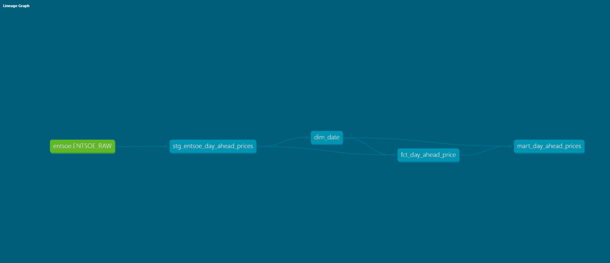

ENTSO-E Energy Pipeline

End-to-End Data Engineering Project

This repository contains an end-to-end data engineering pipeline for processing ENTSO-E day-ahead electricity prices across multiple European bidding zones.

The pipeline covers the full lifecycle of data:
API ingestion → cloud storage → warehouse modeling → analytics-ready mart.

🏗️ Architecture Overview

ENTSO-E API
   ↓ (Python)
AWS S3 (raw JSON)
   ↓
Snowflake (RAW / VARIANT)
   ↓
dbt Staging
   ↓
Dimensions + Fact
   ↓
Analytics Mart (BI-ready)

📂 Repository Structure

entsoe-energy-pipeline/
│
├── ingestion/                 # Python & Lambda ingestion
│   ├── entsoe_api/
│   │   └── fetch_day_ahead_prices.py
│   └── lambda/
│       └── handler.py
│
├── infrastructure/
│   └── snowflake/
│       ├── roles.sql
│       ├── stages.sql
│       ├── pipes.sql
│       └── streams_tasks.sql
│
├── dbt/
│   ├── models/
│   │   ├── staging/
│   │   ├── dimensions/
│   │   ├── facts/
│   │   └── marts/
│   ├── macros/
│   ├── snapshots/
│   ├── analyses/
│   └── dbt_project.yml
│
├── docs/                      # dbt docs (GitHub Pages)
├── README.md
└── .gitignore

🔄 Pipeline Walkthrough

1️⃣ Data Ingestion (Python / AWS)

Python is used to call the ENTSO-E API

Responses are stored as raw JSON files in AWS S3

Designed to be reusable for:

local runs

AWS Lambda

future orchestration (Airflow)

2️⃣ Raw Storage (Snowflake)

Raw JSON files are ingested into Snowflake using:

external stages

VARIANT columns

Raw data is preserved unchanged for traceability and replay

3️⃣ Staging Layer (dbt)

Model: stg_entsoe_day_ahead_prices

Responsibilities:

Parse semi-structured JSON

Extract:

bidding zone

delivery date

hourly position (1–24)

price (EUR/MWh)

Preserve lineage:

filename

load_time

4️⃣ Dimensions
dim_bidding_zone

Maps bidding zone codes (e.g. DE-LU, SE4) to human-readable names

Improves usability for non-technical stakeholders

Enables geographic and map-based analysis in BI tools

dim_date

Standard date dimension

Includes:

year, quarter, month

weekday / weekend flags

5️⃣ Fact Table
fct_day_ahead_price

Grain: one record per (zone, delivery_date, hour position)

Incremental model

Derives:

delivery_datetime

period_of_day (Early Hours, Morning, Midday, Evening, Night)

Preserves all published records

⚠️ ENTSO-E may publish multiple prices for the same hour due to corrections.
These are intentionally preserved to reflect real market behavior.

6️⃣ Analytics Mart (BI-Ready)
mart_day_ahead_prices

View optimized for analytics consumption

Joins:

fact + bidding zone + date dimension

Exposes:

readable zone names

calendar attributes

intraday buckets

price measures

🧪 Data Quality & Testing

dbt tests are applied at the mart level:

not_null tests on all business-critical columns

Uniqueness is intentionally not enforced

Reasoning:
Market data can contain legitimate duplicates due to re-publishing.
In a production setup, versioning or “latest-price” logic would be added.

📘 Documentation & Lineage

dbt documentation is generated using:

"dbt docs generate"

The documentation includes:

-column-level descriptions

-model dependencies

-full lineage graph

🛠️ Tech Stack

Python – API ingestion and data extraction

AWS S3 – Raw data storage

Snowflake – Cloud data warehouse

dbt Core – Transformations, testing, and documentation

SQL – Data modeling

Git / GitHub – Version control and project sharing

🚀 Future Enhancements

Price versioning & late-arriving corrections

Snapshot-based historical tracking

Airflow orchestration

Power BI dashboards built on the mart

📌 Project Summary

ENTSO-E Energy Pipeline provides daily electricity prices across multiple European countries, modeled using modern data engineering best practices and designed for scalable analytics consumption.